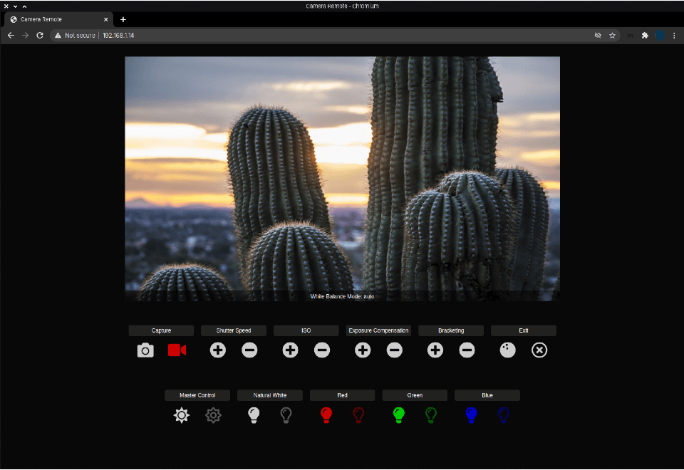

# Camera Remote

Combining this program with a Raspberry Pi HQ camera, a Raspberry Pi Zero WH, and an Adafruit 16-LED NeoPixel ring will result in a camera that can be controlled via a web page.

> [!NOTE]
> The primary intended use of this application is for still photography and photogammetry.  Preview mayb be suspended during video capture due to apparent hardware limitations.   This system can be used to capture video, but it currently is not user-friendly.*

---
## Use With Other Camera Software

**Optionally**, this application may be used in conjunction with one of the following applications:
   - [Camera Zero](https://github.com/eat-sleep-code/camera.zero): Camera Remote can be triggered by long-pressing the pale orange button for 5 - 9 seconds.  You can switch back to trackball control from within Camera Remote.


---
## Getting Started
- Use [Raspberry Pi Imager](https://www.raspberrypi.com/software) to install Raspberry Pi OS Lite *(Bookworm)* on a microSD card
- Use [raspi-config](https://www.raspberrypi.org/documentation/configuration/raspi-config.md) to:
  - Enable the CSI camera interface
  - Set up your WiFi connection
- Connect the Raspberry Pi HQ Camera to your Raspberry Pi


## Installation

Installation of the program, any software prerequisites, as well as DNG support can be completed with the following two-line install script.

```
wget -q https://raw.githubusercontent.com/eat-sleep-code/camera.remote/main/install-camera.sh -O ~/install-camera.sh
sudo chmod +x ~/install-camera.sh && ~/install-camera.sh
```

---

## Usage
```
camera.zero <options>
```

### Options

+ _--rotate_ : Rotate the camera in 90&deg; increments     *(default: 0)*
+ _--exifFStop_ : Set the numeric F-Stop value in the image EXIF data *(default: Not specified)*
+ _--exifFocalLength_ : Set the numeric Focal Length value (mm) in the image EXIF data *(default: Not specified)*
+ _--exifFocalLengthEquivalent_ : Set the numeric 35mm Focal Length value (mm) in the image EXIF data *(default: Not specified)*


### Example
```bash
camera.zero --rotate 180 --exifFStop 2.2 --exifFocalLength 2.75 --exifFocalLengthEquivalent 16
```

> [!TIP]
> The EXIF data shown above is completely optional but may prove useful when using captured images with third-party applications such as photogrammetry software.


### Web Controls



The following attributes can be adjusted from the web interface:

1) Capture
     - Still Photo
     - Video[^1]
1) Shutter Speed
1) ISO
1) Exposure Compensation
1) Bracketing
1) Toggle trackball control (if equipped)
1) Scene Lighting - *currently limited to control of a 16-LED NeoPixel array*
     - All Lights (on/off)
     - Natural White (256 steps)
     - Red (256 steps)
     - Green (256 steps)
     - Blue (256 steps)

---

## Usage
```
camera.zero <options>
```

### Options

+ _--rotate_ : Rotate the camera in 90&deg; increments     *(default: 0)*
+ _--exifFStop_ : Set the numeric F-Stop value in the image EXIF data *(default: Not specified)*
+ _--exifFocalLength_ : Set the numeric Focal Length value (mm) in the image EXIF data *(default: Not specified)*
+ _--exifFocalLengthEquivalent_ : Set the numeric 35mm Focal Length value (mm) in the image EXIF data *(default: Not specified)*


### Example
```bash
camera.zero --rotate 180 --exifFStop 2.2 --exifFocalLength 2.75 --exifFocalLengthEquivalent 16
```

> [!TIP]
> The EXIF data shown above is completely optional but may prove useful when using captured images with third-party applications such as photogrammetry software.

---

[^1]: Due to licensing restrictions, video is captured with an **.h264** format.   To convert the **.h264** file into the more common **.mp4** format, you can execute the following command: `ffmpeg -framerate 30 -i input.264 -c copy output.mp4`